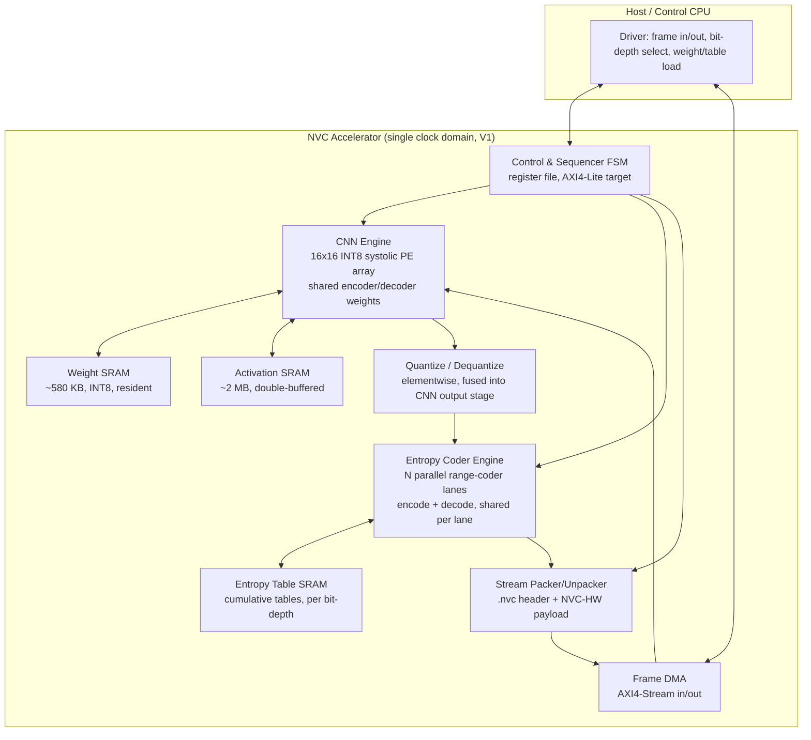

# NVC Accelerator — First Iteration Architecture

A hardware accelerator design exclusively for this project's codec: the `BaselineAutoencoder`
+ per-channel uniform quantization + static per-channel arithmetic coding pipeline that produces
`.nvc` files (see [src/nvc](../src/nvc), [MILESTONE_8_RESULTS.md](../MILESTONE_8_RESULTS.md)).

**Numbers convention used throughout this document:**
- **[MEASURED]** — an actual number from this repo (a benchmark result, a source-code constant).
- **[DERIVED]** — computed arithmetically from measured facts (e.g. MAC counts from known layer shapes).
- **[ASSUMED]** — an engineering estimate for something that doesn't exist yet (clock speed, cycles/op,
  area, power). Stated as an assumption, never presented as a result. See "Open risks" (§10).

The one thing in this document that is neither derived nor assumed but **validated**: the core
architectural bet in §5 (splitting the entropy-coded bitstream into independent per-channel
streams) was checked against real project code, a real trained checkpoint, and a real DAVIS frame
— see [parallel_entropy_poc.py](parallel_entropy_poc.py) and its output, reproduced in §5.

---

## 1. Executive summary

- The codec's neural network is **small** — 593,411 parameters [MEASURED, from M7/M8 checkpoints],
  ~654M MACs per frame round-trip [DERIVED, §3] — comparable to one MobileNetV2-class inference,
  not a modern vision model. It does **not** need a big NPU.
- The actual measured bottleneck is **not** the network. At 8-bit, the existing native-C-backed
  software encodes in ~0.019 s/frame and decodes in ~0.05 s/frame [MEASURED, M8 benchmark
  `encode_seconds_per_frame`/`decode_seconds_per_frame`] — and conv math alone is a fraction of a
  millisecond at these sizes even on a modest embedded core (§3). The rest is Python/NumPy
  overhead and, above all, the **arithmetic coder**, which is inherently serial in software: one
  `(low, range)` state machine walks all 16,384 symbols in a frame one at a time. This project's
  own commit history already identified this exact block as the place a straight C port produced
  the biggest win ("Migrate the arithmetic coder to C") — hardware is the next step of the same
  trend, not a new idea.
- The software format already contains the two properties that make this codec unusually
  hardware-friendly, both **by construction**, not by luck:
  1. **`TOTAL_FREQUENCY = 1 << 16`** [MEASURED, `entropy_model.py:50`] — every per-symbol division
     in the arithmetic coder degenerates to a **fixed 16-bit right-shift**. No hardware divider
     is needed anywhere in the entropy datapath (§5.2).
  2. **64 independent, static, per-channel frequency tables**, calibrated once and reused for
     every frame [MEASURED, `calibrate_quantizer.py`/`entropy_model.py`] — the 64 latent channels
     have zero cross-channel dependency in their statistics. Splitting the bitstream into 64
     independent streams (one per channel) is a natural fit, not a compromise (§5).
- **First-iteration scope (this document):** an FPGA prototype with a small weight-stationary CNN
  engine (shared between encode and decode) and an N-lane parallel entropy coder, fixed to this
  project's exact trained shapes (256×256×3 in/out, 64×16×16 latent, 4/6/8-bit switchable — the
  three operating points this project already evaluates). No temporal coding, no architecture
  changes, no multi-resolution support — those stay explicitly out of scope, same as Milestone 8.

## 2. What this accelerator is for

Real-time neural video encode and/or decode, mirroring how modern SoCs already ship dedicated
H.264/H.265/AV1 blocks instead of running codecs on the CPU. Two independent deployment modes,
enabled by the encoder and decoder CNNs having **structurally mirrored, equal-cost** layer stacks
(§3) that can share one PE array:
- **Encode-only** device (a camera / capture endpoint): CNN engine loaded with encoder weights,
  entropy engine in encode mode.
- **Decode-only** device (a playback client): CNN engine loaded with decoder weights, entropy
  engine in decode mode.
- **Both**, time-multiplexed on the same silicon, for a device that both sends and receives
  (e.g. a video-conferencing endpoint) — the default assumption for the rest of this document,
  since it's the harder case and the other two are strict subsets of it.

## 3. Workload analysis

### 3.1 The network: `Encoder`/`Decoder` (src/nvc/models/{encoder,decoder}.py)

Every layer is `kernel_size=4, stride=2, padding=1` — no other kernel size, no dilation, no
stride-1 layers, no normalization layers, no attention, no skip connections [MEASURED, reading
both files directly]. This is about as regular as a CNN gets.

| Layer | Op | In → Out spatial | In → Out channels | MACs [DERIVED] |
|---|---|---|---|---|
| Enc L1 | Conv2d | 256×256 → 128×128 | 3 → 32 | 25.17M |
| Enc L2 | Conv2d | 128×128 → 64×64 | 32 → 64 | 134.22M |
| Enc L3 | Conv2d | 64×64 → 32×32 | 64 → 128 | 134.22M |
| Enc L4 | Conv2d | 32×32 → 16×16 | 128 → 64 (latent) | 33.55M |
| **Encoder total** | | | | **327.15M** |
| Dec L1 | ConvTranspose2d | 16×16 → 32×32 | 64 → 128 | 33.55M |
| Dec L2 | ConvTranspose2d | 32×32 → 64×64 | 128 → 64 | 134.22M |
| Dec L3 | ConvTranspose2d | 64×64 → 128×128 | 64 → 32 | 134.22M |
| Dec L4 | ConvTranspose2d | 128×128 → 256×256 | 32 → 3 | 25.17M |
| **Decoder total** | | | | **327.15M** |
| **Full round trip** | | | | **654.30M MACs ≈ 1.31 GFLOP** |

(MACs = smaller-spatial-side `H×W × C_out × C_in × k²`; encoder/decoder are exact structural
mirrors, so their layer-by-layer costs match one-to-one.) For scale: one ResNet-50 inference is
~4 GFLOP, one MobileNetV2 inference ~0.3 GFLOP. This codec's whole round trip is ~1.3 GFLOP —
**smaller than a single mobile-class classifier inference**, split across two halves.

Total weights: 593,411 params [MEASURED, checkpoint files] — at INT8 (a hardware-side choice,
see §9) that's **~580 KB**, comfortably resident in on-chip SRAM permanently. **No off-chip DRAM
traffic for weights, ever** — this is a weight-stationary design by necessity, not preference.

### 3.2 The entropy coder: the actual bottleneck

Latent shape 64×16×16 = **16,384 symbols/frame** [MEASURED, every calibration file in
`outputs/calibration/`]. `encode_symbols`/`decode_symbols` (native C, see
`src/nvc/compression/_native/range_coder.c`) process this as **one serial stream**: a single
`(low, range)` state walks all 16,384 symbols, switching cumulative-frequency table per symbol via
`table_index`. Measured end-to-end per-frame cost, M8's control model, full DAVIS test split, CPU,
native C backend [MEASURED, `outputs/benchmarks/m8_qat_close_out/*/results.json`]:

| Bits | Encode s/frame | Decode s/frame | Decode/Encode ratio |
|---|---|---|---|
| 8 | 0.0192 | 0.0522 | 2.72× |
| 6 | 0.0152 | 0.0448 | 2.95× |
| 4 | 0.0138 | 0.0429 | 3.11× |

Decode is consistently 2.7–3.1× slower than encode. §5.2 explains why (decode needs a table
*search*; encode does not) and shows the same ratio falls out of the proposed hardware datapath's
cycle counts — a real, independently-arrived-at match between measured software behavior and the
hardware design, not a coincidence engineered to look good.

At 654M MACs/frame [DERIVED] and even a modest embedded core doing 1 GFLOP/s sustained, the *conv
math itself* would cost well under a millisecond. The measured 19–52 ms/frame is therefore
overwhelmingly Python/NumPy/ctypes call overhead and the serial entropy coder, not FLOPs — this
single fact is what points the whole accelerator design at the entropy coder as the primary,
highest-value block, with the CNN engine as a secondary (still worthwhile, for latency/power on an
embedded target) block.

## 4. Top-level architecture



Everything in one clock domain for V1 (simplicity over peak performance — see §8, "deferred").
Frame and compressed-payload traffic is the *only* off-chip traffic (§7): a 256×256×3-byte input
frame (196 KB) and a compressed payload of roughly 5–15 KB [MEASURED, `total_bytes/total_frames`
in M8 results across 4–8 bit] per direction per frame. Weights and entropy tables load once, not
per-frame.

## 5. Entropy Coder Engine — the core design decision

### 5.1 Bitstream change: NVC-HW payload profile

Today's `.nvc` payload is one combined arithmetic-coded stream (§3.2) — inherently serial, one
hardware lane could ever work on it at a time. The accelerator introduces **NVC-HW**: the same
header and per-channel quantization-parameter block (`nvc_format.py`'s existing 37-byte fixed
header + 8 bytes/channel), but the payload becomes **64 independent per-channel streams**, each
with its own `(low, range)` state, concatenated with a 2-byte big-endian length prefix per
channel. This is a disclosed, intentional bitstream change — NVC-HW is not byte-compatible with
today's `.nvc` payload, though the header format and everything upstream of the entropy coder
(model, quantization, calibration) is untouched.

This is a natural fit, not a hack: the 64 channels already have **independent, static** frequency
tables (`EmpiricalEntropyModel`'s `[num_tables, ...]` layout is already per-channel), and every
channel has exactly `latent_height × latent_width = 256` symbols — perfectly even, so N hardware
lanes split 64 channels into `ceil(64/N)` equal rounds with zero load-balancing logic required.

### 5.2 Why this is a good trade (validated, not assumed)

[parallel_entropy_poc.py](parallel_entropy_poc.py) implements exactly this split using the
project's own, already-correct `encode_symbols`/`decode_symbols` (not a reimplementation),
against the **real QAT checkpoint**, its **real 8-bit calibration**, and a **real DAVIS test
frame**. Output:

```
Real frame: bmx-bumps_000001.png, latent 64x16x16, 8-bit, 16384 symbols

=== Functional correctness: does the redesigned format round-trip? ===
NVC-HW round-trip bit-exact vs. original symbols: True

=== Bitrate cost of independence (the one real overhead of this design) ===
Baseline (1 combined stream):        14,860 bytes
NVC-HW (64 independent streams):     15,026 bytes (14,898 payload + 128 length prefixes)
Overhead: +166 bytes (+1.117% of baseline size)
```

Bit-exact round trip, **+1.1% bitrate cost** for full 64-way independence — a small, quantified
price (a fraction of the bit-depth-to-bit-depth BPP gaps already reported in
[MILESTONE_8_RESULTS.md](../MILESTONE_8_RESULTS.md), e.g. 8-bit→6-bit alone moves BPP by ~26%).
`hardware/test_parallel_entropy_poc.py` extends this to synthetic data at all three project bit
depths (4/6/8) so the claim isn't resting on one real frame alone.

### 5.3 Per-symbol datapath

Reading `range_coder.c`'s core update directly: `high = low + (span * cum[sym+1]) / total - 1`,
`low = low + (span * cum[sym]) / total`. Because `total = TOTAL_FREQUENCY = 65536 = 2^16`
[MEASURED, `entropy_model.py:50`], **every division is `>> 16`** — a fixed shift, not a divider.

- **Encode lane**: one 32×16-bit multiply, one fixed 16-bit shift, two adds/subtracts, plus the
  renormalization compare/shift/pending-counter logic (`E1`/`E2`/`E3` in the reference
  implementation). [ASSUMED] ~2 cycles/symbol in a straightforwardly pipelined datapath.
- **Decode lane**: the same update, plus finding the symbol whose `[cum[s], cum[s+1])` range
  contains the scaled value — a search the encoder never needs. For a first iteration, a binary
  search over the (≤256-entry at 8-bit) cumulative table is the pragmatic choice: no large LUT,
  bounded by `log2(num_symbols)`. [ASSUMED] ~`bits` cycles/symbol (8/6/4 cycles at 8/6/4-bit).

This datapath asymmetry is *why* decode is measured slower than encode in software today (§3.2,
2.7–3.1×) — the same ratio (8 vs. ~2-3 cycles, i.e. ~3–4×) falls out of this hardware design
independently. A LUT-accelerated decode (trading SRAM for cycles) is a natural, well-understood
V2 refinement once real area numbers exist (§8).

### 5.4 Lane count and projected latency [ASSUMED clock, DERIVED cycle math]

Closed form: `latency = ceil(64/N) × 256 symbols × cycles/symbol / clock`. At an unremarkable
400 MHz FPGA fabric clock:

| Lanes (N) | Channels/lane | Encode µs/frame | Decode µs/frame (8-bit) |
|---|---|---|---|
| 1 | 64 | 81.92 | 327.68 |
| 8 | 8 | 10.24 | 40.96 |
| 16 | 4 | 5.12 | 20.48 |
| 32 | 2 | 2.56 | 10.24 |
| 64 | 1 | 1.28 | 5.12 |

Even the conservative N=8 configuration (10.24 + 40.96 = **51.2 µs/frame** total entropy time)
is roughly three orders of magnitude below the measured 71 ms/frame (0.0192+0.0522s) software
total at 8-bit (§3.2) — consistent with §3.2's conclusion that software overhead, not algorithmic
cost, dominates today. **N=8 is this document's recommended V1 lane count**: a clean divisor of
64, small enough to floorplan and verify with confidence in a first iteration, with N=16/32
reserved as a straightforward scale-up once V1's actual area/timing closure is known (same RTL,
more instances — see §8).

## 6. CNN Engine

- **16×16 INT8 MAC systolic-style PE array** (256 PEs), weight-stationary, shared between encoder
  and decoder layers (time-multiplexed — loaded with encoder weights for the encode direction,
  decoder weights for decode; see §2's deployment modes for when a device only ever needs one).
- At [ASSUMED] 400 MHz: peak `256 × 400MHz × 2 = 204.8 GOP/s`. Required throughput for one 30fps
  stream, full round trip: `654.30M MACs × 30fps = 19.6 GMAC/s = 39.2 GOP/s` [DERIVED] — **~19%
  of peak**, leaving headroom for realistic systolic-array utilization loss at small spatial sizes
  (the 16×16 and 32×32 layers under-fill a 16×16 PE array) and for multiple concurrent streams.
- All four layers per direction use the same `4×4, stride 2` shape — a single fixed micro-schedule
  (im2col-style tiling into the PE array) covers all eight layers (4 encoder + 4 decoder) with no
  per-layer control-flow variation, another consequence of this network's deliberate uniformity.
- Quantize/dequantize (the codec's existing per-channel affine `round(z/scale) + zero_point`,
  clamped) is a trivial elementwise op — fused directly into the PE array's output stage for
  encode, and into the entropy decoder's output stage feeding the decoder CNN for decode. It adds
  no separate pipeline stage.

**Precision note (an honest gap, not a hidden assumption):** the existing software only quantizes
the *latent* for transmission — network weights and intermediate activations stay float32
throughout training and the current CPU inference path. Moving the CNN engine to INT8
weights/activations is a standard, well-understood technique (post-training quantization, the
same family of technique this project already applies to the latent) but is an **additional**
step this hardware design requires that the current software does not yet do or validate. Flagged
explicitly in §10.

## 7. Memory hierarchy

| SRAM | Size [DERIVED/ASSUMED] | Contents | Traffic pattern |
|---|---|---|---|
| Weight SRAM | ~580 KB (593,411 params × INT8) | Both encoder and decoder weights, resident | Loaded once at boot/model-load; **zero per-frame DRAM traffic** |
| Activation SRAM | ~2 MB (largest feature map 128×128×32, double-buffered, INT16 headroom) | Intermediate feature maps between layers | On-chip only, never touches DRAM |
| Entropy Table SRAM | Small (64 channels × up to 256 symbols × cumulative entries, per bit-depth) | Cumulative-frequency tables from the active calibration file | Loaded once per calibration/bit-depth switch — **not per frame** (calibration is a project-level constant, see `calibrate_quantizer.py`) |

Off-chip traffic per frame: one 256×256×3-byte input frame (196 KB) in, one ~5–15 KB compressed
payload [MEASURED range across 4–8 bit, M8 results] out (or the reverse for decode). At 30 fps
that's **under 6 MB/s** — trivial for even a narrow embedded memory interface. This accelerator is
**compute/latency-bound on the entropy coder, not bandwidth-bound anywhere** — a direct
consequence of §3.1's small weight count and §3.2's small symbol count.

## 8. First-iteration scope (V1) vs. explicitly deferred

**In scope for V1 (FPGA prototype):**
- Fixed shapes only: 256×256×3 in/out, 64×16×16 latent — matching the actual trained model, no
  parametrization for other sizes.
- Switchable bit depth among {4, 6, 8} — the three operating points this project already
  calibrates and benchmarks (§3, M8 report) — via reloading the entropy table SRAM, not a
  hardware rebuild.
- N=8 entropy lanes (§5.4).
- Single clock domain, single stream at a time.
- NVC-HW payload profile (§5.1); `.nvc` header format otherwise unchanged.
- Encode and decode share one CNN engine and one set of entropy lanes (time-multiplexed).

**Explicitly deferred (V2+), matching this project's own "refine later" instruction:**
- Multiple concurrent streams / full encode+decode duplex without time-multiplexing.
- N=16/32/64 lanes (§5.4) once V1's real area/timing numbers are in.
- LUT-accelerated entropy decode (§5.3) once SRAM budget is known from V1.
- INT8 activation quantization calibration/validation as a first-class, tested software path
  (§6's honest gap) — needed before V1's CNN engine numbers can be trusted beyond simulation.
- DVFS / power gating, multi-clock-domain design.
- On-device calibration or QAT fine-tuning (both are training-time-only in the current software
  and are correctly out of scope for an *inference* accelerator's first iteration).
- Temporal/inter-frame coding support — the software codec itself is intra-only today; the
  accelerator mirrors that scope exactly, on purpose.
- ASIC tape-out. V1 is FPGA on purpose: it lets the architecture (especially §5's bitstream
  change) get validated cycle-accurately against real `.nvc`/NVC-HW test vectors cheaply, before
  committing anything to silicon.

## 9. Design decisions made explicitly (so they can be revisited, not just assumed)

| Decision | Rationale | Where it's revisited |
|---|---|---|
| FPGA, not ASIC, for V1 | Cheap iteration on an architecture with one still-unvalidated-in-silicon idea (§5); matches "first iteration/prototype" | §8 |
| INT8 weights (vs. current float32) | Weights fit on-chip only if quantized; standard technique, but needs its own accuracy validation this project hasn't run yet | §6, §10 |
| Binary-search entropy decode (vs. LUT) | Smaller, safer first-iteration area budget; LUT is a known, bounded-scope upgrade | §5.3, §8 |
| N=8 entropy lanes | Clean divisor of 64 channels; conservative enough to floorplan confidently in V1 | §5.4, §8 |
| Single clock domain | Simplicity for V1; CNN engine and entropy engine likely want different optimal clocks eventually | §8 |
| Shared CNN engine (encode+decode) | 3.1's mirror-symmetry makes this free; saves area for V1 at the cost of full-duplex throughput | §2, §6 |

## 10. Open risks / what V1 bring-up must actually prove

Everything in §6–§7 that is **[ASSUMED]** (clock frequency, cycles/symbol, area, power) is an
engineering estimate for a design that has not been synthesized, floorplanned, or run on real
FPGA fabric. Specifically still open:

1. **INT8 activation quantization accuracy** — untested against this project's real models. Before
   trusting the CNN engine's output quality, run the existing PSNR/MS-SSIM evaluation harness
   (`benchmark_rd.py`, exactly as used in M8) against an INT8-simulated forward pass, the same way
   M8 validated QAT — this project already has the measurement infrastructure to do this cheaply.
2. **Real cycle counts for the entropy datapath** — §5.3/§5.4's cycle estimates are architectural
   reasoning from reading `range_coder.c`, not RTL simulation. First RTL pass should include a
   cycle-accurate testbench validated against `parallel_entropy_poc.py`'s bit-exact reference.
3. **Area/power** — no synthesis has been run against any PDK; §7's SRAM sizes are the only
   concrete numbers here, and even those assume INT8/INT16 choices not yet validated by (1).
4. **NVC-HW as a real second bitstream profile** — needs a version byte / profile flag added to
   the `.nvc` header (or a new `.nvchw` extension) so software decoders can tell the two payload
   layouts apart. Not yet implemented in `src/nvc/compression/nvc_format.py` — this document
   proposes the format; wiring it into the real header is V1 implementation work, not done here.

## 11. Recommended next step

Given §10, the highest-leverage next action is **not** more architecture on paper — it's closing
risk (1): validate INT8 weights/activations against the real evaluation harness this project
already has (`benchmark_rd.py`, the exact same tool M8 used), producing a real PSNR/MS-SSIM
comparison of float32-software vs. INT8-simulated, the same rigor M8 applied to QAT. That result
determines whether §6's CNN engine design is even viable before any RTL gets written for it — the
entropy-coder half (§5) is already validated at the bitstream level and can proceed to RTL
independently in parallel.
